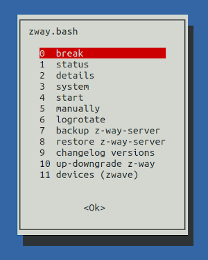
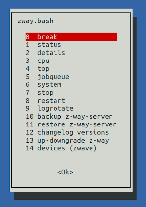

# MxBash Linux Tools

This package contains a collection of useful Linux bash scripts for 
administration of Z-Way, such as start, stop, backup, update, cpu analysis, 
rotate logs, .... 
They can be conveniently started from a menu. The module does nothing but 
download the software. 

 

## Prerequisites

Z-Way.

## Installation

- download the package from the Z-Way App Store
- make the bash scripts executable, if they aren't (sudo chmod a+x *.bash)
- rename the file **params_template** to **params** and enter your data
  (necessary for some functions)
- for convenient call of zway.bash without path add this to your **~/.profile**:
  + USERMODULES="/opt/z-way-server/automation/userModules"
  + PATH="$USERMODULES/MxBash/sh/:$PATH"

## Start the Menu

zway.bash

## Z-Way Start/Stop Management

This script can use the new start/ stop mechanism **Systemd**, availabe in
many current Linux distributions. To take 
advantage of the benefits, follow the installation instructions in the 
**z-way-server.service** file.

Please note: Don't delete the **SysVinit** configuration file **/etc/init.d/z-way-server**.
It is still used by Z-Way, for example during an upgrade.

## License: MIT

Copyright © 2024 piet66

Permission is hereby granted, free of charge, to any person obtaining a copy 
of this software and associated documentation files (the "Software"), to deal 
in the Software without restriction, including without limitation the rights 
to use, copy, modify, merge, publish, distribute, sublicense, and/or sell 
copies of the Software, and to permit persons to whom the Software is furnished 
to do so, subject to the following conditions:

The above copyright notice and this permission notice shall be included in all 
copies or substantial portions of the Software.

THE SOFTWARE IS PROVIDED "AS IS", WITHOUT WARRANTY OF ANY KIND, EXPRESS OR 
IMPLIED, INCLUDING BUT NOT LIMITED TO THE WARRANTIES OF MERCHANTABILITY, 
FITNESS FOR A PARTICULAR PURPOSE AND NONINFRINGEMENT. IN NO EVENT SHALL 
THE AUTHORS OR COPYRIGHT HOLDERS BE LIABLE FOR ANY CLAIM, DAMAGES OR OTHER 
LIABILITY, WHETHER IN AN ACTION OF CONTRACT, TORT OR OTHERWISE, ARISING FROM, 
OUT OF OR IN CONNECTION WITH THE SOFTWARE OR THE USE OR OTHER DEALINGS IN THE 
SOFTWARE.

